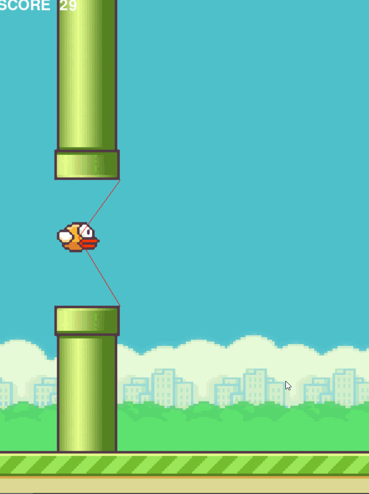
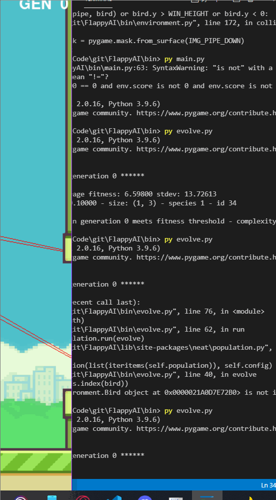

# FlappyAI
Flappy bird automation using Neuroevolution of Augmenting Topologies (NEAT) in Python



# Everything Used
* Genetic Algorithm especially NEAT concept
* Unsupervised Learning
* Neural Network
- NEAT-Python used in developing the Genetic Algorithm (NEAT) and also the Neural Network (Forward Propagation)
- Matplotlib and Pillow used in the visualization of the neural network
- Pygame used for creating the game (Environment)

# Files Documentation
- Bin (All of the python scripts are here)
  - environment.py  > Helper class that control the game itself (Rendered, Pipe, Bird, Gravity, and also game speed)
  - evolve.py       > Genetic Algorithm for generating the best individual
  - main.py         > Using the generated best individual from evolve.py and then put the individual to the game alone
  - visualize.py    > Helper class that visualize the neural network in another window
- Img (Assets that is used by the game)
- Model (Where the best individuals are stored)




# Resource
- [NEAT - Introduction](https://www.youtube.com/watch?v=VMQOa4-rVxE)
- [NEAT-Python lib](https://neat-python.readthedocs.io/en/latest/)

# Installation
In case you want to try it on your local machine
1. Clone
2. Enter the virtual env
   - in windows powershell you can
   ```
   cd Scripts
   ./activate
   ```
3. And now you can run the scripts inside [/bin](bin)
- You don't need to install the requirements inside [requirements.txt](requirements.txt) when you use the virtual env


# Notes
- In the main.py, default best bird is still hard coded (I think I just deleted the .pickle files but still manage to stored those value, you can customize and make your own bird farm)
- Using the above hard coded sample, I've never seen the bird fail
- Game speed, visualization of the neural network can be customized in main.py hyperparam
- Feel free to reach me in [discord](https://discordapp.com/users/745936749775028285/)
